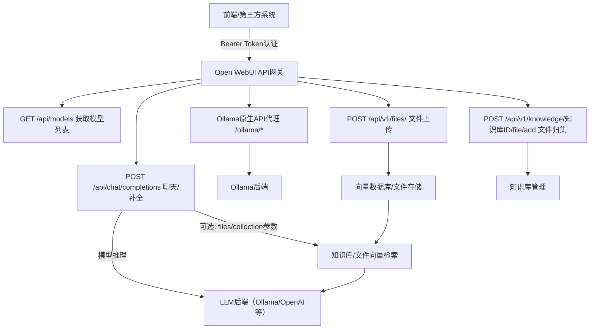

# Open WebUI 二次开发约束与接口流程图操作手册

---

## 一、开发约束模块（建议团队严格执行）

### 1. 认证与安全
- 所有 API 调用必须通过 Bearer Token 认证，Token 统一由配置中心或安全模块管理。
- 禁止在前端代码中硬编码 Token，Token 仅存于安全存储（如 HttpOnly Cookie、环境变量等）。

### 2. 接口调用规范
- 所有接口调用必须通过统一的 API Client（SDK）封装，禁止直接在业务代码中拼接 URL。
- API Client 需内置重试、超时、错误码统一处理机制。
- 所有接口调用必须有详细的参数校验和异常捕获，错误需分级上报。

### 3. 业务流程约束
- 文件上传、知识库归集、RAG 检索等流程必须严格按官方推荐顺序调用接口，禁止跳步或绕过。
- 聊天/补全接口如需引用知识库，必须先完成文件上传和归集，获取到合法的 file_id 或 collection_id。
- 所有模型相关操作必须先通过 `/api/models` 获取模型列表，禁止硬编码模型名。

### 4. 版本与兼容性
- 严格跟踪官方 API 版本变更，接口升级需全量回归测试。
- 业务代码与 API Client 版本强绑定，升级需同步。

### 5. 日志与监控
- 关键接口调用需记录操作日志，内容包括：调用人、时间、参数、返回值、异常信息。
- 需接入统一监控平台，接口异常需自动告警。

### 6. 文档与协作
- 每个接口调用必须有对应的开发文档和使用示例，文档需与代码同步更新。
- 团队内定期 Code Review，重点检查接口调用规范和安全合规性。

---

## 二、Open WebUI 典型接口流程图

---

## 三、开发流程建议

1. 需求评审 → 画出接口流程图 → 设计 API Client 封装
2. 先用 Swagger/Postman 验证接口 → 再写自动化测试用例
3. 业务开发全程只通过 API Client 调用接口
4. 每次接口变更都需回归测试和文档同步
5. 代码上线前必须 Code Review，重点检查接口调用和安全

---

如需更详细的代码模板、接口参数说明或团队协作规范，可随时补充！ 